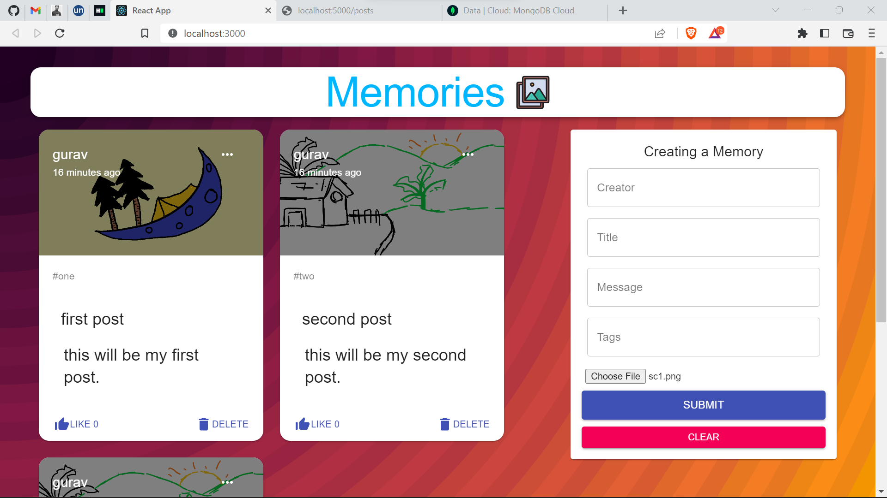
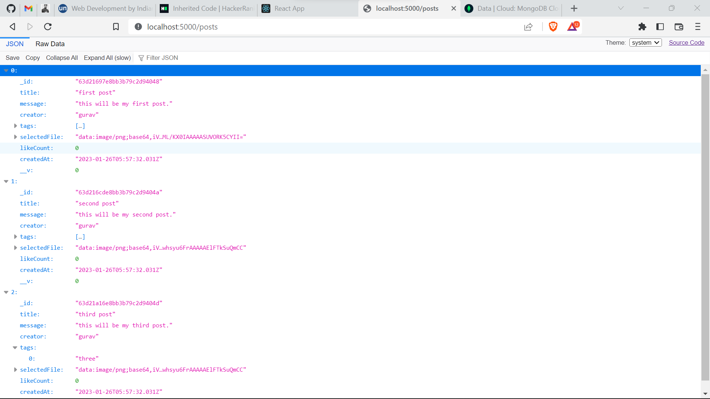

# Memories
### (fullstack project)

## Table of contents

- [Overview](#overview)
  - [Working](#working)
  - [Screenshot](#screenshot)
  - [Links](#links)
- [My process](#my-process)
  - [Built with](#built-with)
- [Author](#author)

## Overview

### Working

"npm start" in server and "npm start" in client.

Users should be able to:

- Create a post
- See hover and focus states for all interactive elements on the page

### Screenshot

### Links

- GitHub URL: [GitHub](https://github.com/Gauravtripathii/memories-fullstack)

## My process

### Built with

- [React](https://reactjs.org/)
- [Node](https://nodejs.org/en/)
- [Express](https://expressjs.com/)
- [Tailwind css with react](https://tailwindcss.com/docs/guides/create-react-app)
- [Material UI](https://mui.com/)

## Author

- GitHub - [@Gauravtripathii](https://github.com/Gauravtripathii/)
- Frontend Mentor - [@Gauravtripathii](https://www.frontendmentor.io/profile/Gauravtripathii)
- LinkedIn - [@Gaurav Kumar Tripathi](https://www.linkedin.com/in/gaurav-kumar-tripathii/)
- Twitter - [@gaurav0tripathi](https://twitter.com/gaurav0tripathi)
